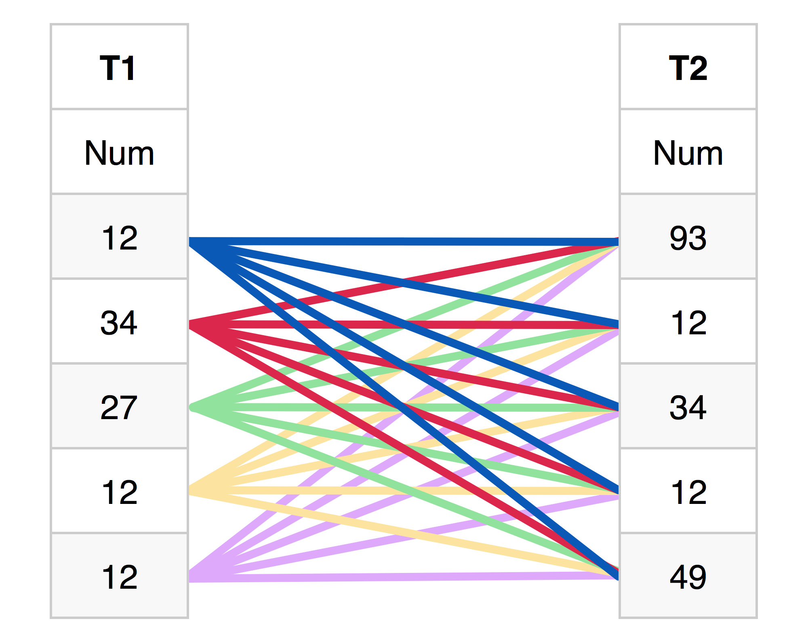

# SQL
<center>[Home](../index.html)</center>

[TOC]

## Syntax

- **[] :** _Désigne une option_  
- **| :** _Désigne un choix (ou)_  
- **{} :** _Désigne une liste d'éléments à choisir_

### Comment

_Insert a comment line is easy: you only have to add **--** before your comment._

```sql
-- This is a comment line
```

### Naming Convention
_**From **_

> When having logical noun/verb **language separations**, component names will
be separated by the **underscore** character to indicate the separation.

#### Column

> **e.g.** _A column storing a user’s date of birth would be named **date\_of\_birth** and  
a column storing time elapsed in seconds would be named **time\_elapsed\_in\_seconds**._

#### Table

> Table names will be defined in the plural. This is because a table is itself
a collection of **1 or more row entities** (plural), and this naming convention
is also better understood in the object oriented world.

> **e.g.** _A table storing records of customer location addresses
would be named **customer\_location\_addresses** (rather than **customer\_location\_address**)._

**RQ:** _The name of a table can begin with a **capital letter**._

#### Primary key

**Format**

```sql
CONSTRAINT pk_table_name PRIMARY KEY (column_name)
```

**Example:**

```sql
CREATE TABLE IF NOT EXISTS Clients (
...,
CONSTRAINT pk_Clients PRIMARY KEY (numéro_client),
...
);
```

#### Foreign key

**Format**

_The **source** is the source table, **column** is the column which will be the **fk** and **target** is the target table._

```sql
CONSTRAINT fk_source_column_target FOREIGN KEY (column_name) REFERENCES target_table(column_name)
```

**Example:**

```sql
CREATE TABLE IF NOT EXISTS Commandes (
...,
CONSTRAINT fk_commandes_numéro_client_clients FOREIGN KEY (numéro_client) REFERENCES Clients(numéro_client),
...
);
```

#### Check

**Format**

```sql
CONSTRAINT ck_column_name CHECK(column_name condition)
```

**Example:**

```sql
CREATE TABLE IF NOT EXISTS Produits (
...,
CONSTRAINT ck_quantité_stock CHECK(quantité_stock >= 0),
...
);
```

## Create Database

### Format

```sql
CREATE DATABASE [IF NOT EXISTS] db_name
[DEFAULT] CHARACTER SET [=] charset
[DEFAULT] COLLATE [=] collation;
```

### Example

```sql
CREATE DATABASE IF NOT EXISTS Parc
CHARACTER SET utf8
COLLATE utf8_general_ci;
```

## Create Table

### Format

```sql
CREATE TABLE [IF NOT EXISTS] tbl_name (
	create definition…
) [table_options] [partition_options];
```

### Example

```sql
CREATE TABLE IF NOT EXISTS Clients (
	numéro_client VARCHAR(4),
	nom VARCHAR(15),
	localité VARCHAR(15),
	catégorie VARCHAR(2),
	compte INT(7),
	CONSTRAINT pk_Clients PRIMARY KEY(numéro_client)
)
ENGINE = INNODB;
```

## Queries

### Simple

#### Format

```sql
SELECT column_name, function(column_name)
FROM table_name
WHERE condition;
```

#### Examples

##### Display one or several column_names

```sql
SELECT numéro_client, nom
FROM Clients
WHERE localité <=> 'TOULOUSE';
```

numéro_client|nom
---|---
B512|GILLET
C003|AVRON
D063|MERCIER
F011|PONCELET
K729|NEUMAN

##### Display all column_names

<!-- **RQ:** _On peut utiliser **=**, mais ce n'est pas fonctionnel avec **NULL** au contraire de **<=>**._ -->

```sql
SELECT *
FROM Clients
WHERE localité <=> 'TOULOUSE';
```

numéro_client|nom|localité|catégorie|compte
---|---|---|---|---
B512|GILLET|Toulouse|B1|-8700.00
C003|AVRON|Toulouse|B1|-1700.00
D063|MERCIER|Toulouse|NULL|-2250.00
F011|PONCELET|Toulouse|B2|0.00
K729|NEUMAN|Toulouse|NULL|0.00

### Conditions

#### First - equality

Operator|Use
---|---
**=**| Equal _(can't be used with **NULL**)_
**<=>** or **is**| Equal _(also with **NULL**)_
**!=**| Different _(can't be used with **NULL**)_
**<>** or **is not**| Different _(also with **NULL**)_
**<**| Smaller
**<=**| Smaller or equal
**>**| Greater
**>=**| Greater or equal
**AND**| AND
**OR** | OR
**NOT**|Opposite

⇒ We'll use **<=>** instead of **=**.

#### IN

> This condition is used for a search into a list.  
> **RQ:** _When the search item isn't in the list, week-end can use **NOT IN**._

**Format**

```sql
SELECT numéro_client
FROM Clients
WHERE catégorie IN ('C1',  'C2', 'C3');
```

#### BETWEEN

> This condition is used for a search in a range, instead of using **<=** and **>=**.   
> **RQ:** _To exclude a range, use **NOT BETWEEN**._

```sql
SELECT numéro_client
FROM Clients
WHERE compte BETWEEN 1000 AND 4000;
```

#### LIKE

How to search for strings ?  
Using **LIKE** is the solution, there are two _jokers_:  

- **%**: any string of any length  
- **_**: an only character

> _**As always**, you can exclude a string with **NOT LIKE**._

**Format**

```sql
SELECT column_name
FROM table_name
WHERE column_name LIKE 'name%';
```

**EXAMPLES**

##### Search for one and only char after the input

```sql
SELECT numéro_client
FROM Clients
WHERE catégorie LIKE 'B_';
```

The results could be: **B1** or **Bd**.  
They couldn't be: **xB**, **B** or **B12**.

##### Search for a string containing the input

```sql
SELECT numéro_produit
FROM Produits
WHERE Libelle LIKE '%SAPIN%';
```

The results could be: **Boite en SAPIN** or **SAPIN verni**.  
They couldn't be: **Boite en Sapin** or **S A P I N verni**.

### DISTINCT keyword

#### Format

**RQ:** _Le mot clé doit se trouver à l'**intérieur** de la fonction._

```sql
SELECT DISTINCT column_name, function(DISTINCT  column_name)
FROM table_name
WHERE condition;
```

#### Examples

##### Without DISTINCT

```sql
SELECT localité
FROM Clients
WHERE catégorie <=> 'C1';
```

|localité|
|---|
|Poitiers|
|Namur|
|Poitiers|
|Namur|
|Namur|

##### With DISTINCT

```sql
SELECT DISTINCT localité
FROM Clients
WHERE catégorie <=> 'C1';
```

|localité|
|---|
|Namur|
|Poitiers|

### Alias - _AS_

**Example**

```sql
SELECT numéro_produit AS Produit, 0.21*prix*quantité_stock AS Valeur_TVA
FROM Produits
WHERE quantité_stock > 50000; 
```

Produit|Valeur_TVA
---|---
CS264|67788
PH222|37770.6

### GROUP BY

> To group several results from a same column and use it with an aggregation function.  
> An advantage of using **GROUP BY** is the **automatic sorting** of the values.

**Format**

```sql
SELECT column_name, func(column_name)
FROM table_name
GROUP BY column_name;
```

**Example:**

- Without GROUP BY

```sql
SELECT localité, COUNT(*) AS nombre_clients
FROM Clients;
```

localité|nombreClients
---|---
Bruxelles|16

_Displays the first alpha-numerical value and count all values._

- With GROUP BY

```sql
SELECT localité, COUNT(*) AS nombre_clients
FROM Clients
GROUP BY localité;
```

localité|nombreClients
---|---
Bruxelles|1
Geneve|1
Lille|1
Namur|4
Paris|1
Poitiers|3
Toulouse|5

_Displays the sorted grouped values and the linked count values._

### ORDER BY

<!-- **WARNiNG**  
_This command has to be used on **grouped** column(s) or on an **aggregation function** as **alias**._  
**WARNING** -->  
> To sort the result table after **one or several** columns in ascending (**ASC**) or descending (**DESC**) order.  
> **RQ:** The **default order** is ascending but it's better to use it.

**Format**

```sql
SELECT column_name
FROM table_name
ORDER BY column_name;
```

**Example:**

```sql
SELECT *
FROM Produits
ORDER BY prix;
```

numéro_produit|prix|quantité_stock
---|---|---
CS262|75|45
PA60|95|134
PA45|105|580
CS264|120|2690
PS222|185|1220
CS464|220|450
PH222|230|782

### HAVING

> **HAVING** is like **WHERE** but it filters using functions like **SUM, COUNT, AVG,…**.  
> It allows to select the chosen column, by **grouping** the identical values of the column, and to respect the **condition**.

> _Because the command **groups** the values, it isn't necessary to use **GROUP BY** whith it._

**Format**

```sql
SELECT column_name, func(column_name)
FROM table_name
GROUP BY column_name
HAVING condition;
```

**Example:** _See the **GROUP BY** example_

```sql
SELECT localité, COUNT(*) AS nombre_clients
FROM Clients
GROUP BY localité
HAVING COUNT(*) >= 3;
```

localité|nombreClients
---|---
Namur|4
Poitiers|3
Toulouse|5

### WHERE VS HAVING

_In addition to working with functions, there is another difference between **WHERE** and **HAVING**:_  

- _**WHERE** makes a selection on the rows_  
- _**Having** makes it on the groups_

### Reading order

This is an example of the reading order of a more complex query:

```sql
7: SELECT column_name
1: FROM table_name
2: WHERE condition
3: AND otherCondition
4: GROUP BY column_name
5: HAVING condition
6: ORDER BY column_name
```

## Joins

> An SQL JOIN clause is used to combine rows from two or more tables, based on a common field between them.  

> The most common type of join is: **SQL INNER JOIN (simple join)**. An SQL INNER JOIN returns all rows from multiple tables where the join condition is met.

## Set operations

Imagine you have 2 tables (**T1** and **T2**):

T1||T2
:---:|---|:--:
Num||Num
12||93
34||12
27||34
12||12
12||49

### Union

> The UNION operator is used to combine the result-set of two or more SELECT statements.  

> Notice that each SELECT statement within the UNION must have the same number of columns. The columns must also have similar data types.  

> The mathematical notation is: **T1 ∪ T2**


The MySQL code will be:  

```sql
SELECT Num FROM T1
UNION
SELECT Num FROM T2;
```

The result is:  

|**T1 ∪ T2**|
|:---:|
|12|
|34|
|27|
|93|
|49|

### Intersection

> The intersection is used to return the results of two or more SELECT statements.  

> Each SQL statement must have the same number of fields in the result sets with similar data types.  

> The mathematical notation is: **T1 ∩ T2**


The MySQL code will be:  

```sql
SELECT DISTINCT Num
FROM T1
WHERE T1.Num IN
	(SELECT T2.Num
	 FROM T2);
```

The result is:  

|**T1 ∩ T2**|
|:---:|
|12|
|34|

### Difference

> The difference is used to return all rows in the first SELECT statement that are not returned by the second SELECT statement.  

> Each SELECT statement must have the same number of fields in the result sets with similar data types.  

> The mathematical notation is: **T1 − T2**


The MySQL code will be: 

```sql
SELECT DISTINCT Num
FROM T1
WHERE T1.Num NOT IN
	(SELECT T2.Num
	 FROM T2);
```

The result is:  

|**T1 − T2**|
|:---:|
|27|

### Cartesian product

> Returns the Cartesian product of the sets of records from the two or more joined tables.  
> Thus, it equates to an inner join where the join-condition always evaluates to True or where the join-condition is absent from the statement.  

> The mathematical notation is: **T1 × T2**



The MySQL code will be:  

```sql
SELECT T1.Num, T2.Num
FROM T1, T2;
```

The result is:  

|**T1 × T2**|
|:---:|
|12 ⏤ 93|
|12 ⏤ 12|
|12 ⏤ 34|
|12 ⏤ 12|
|12 ⏤ 49|
|34 ⏤ 93|
|34 ⏤ 12|
|…|
|12 ⏤ 49|

## Subqueries

> We use **subqueries** when we want a response from several tables.  
> For instance, we want the **numéro_commande** from the **Client**s living in **Namur**.  
> ⇒ **numéro_commande** is from _Commande_ and **Namur** is from _Client_.  

### Format of a simple subquery
_The query will be:_

```sql
SELECT numéro_commande, date_commande
FROM Commandes
WHERE numéro_client in (SELECT numéro_client
				FROM Clients
				WHERE localité <=> 'Namur');
```
_Where the **inner** query is named **subquery**._

**RQ:** _The reading direction is **bottom-up**._

## Functions

### Aggregation functions

There a five functions:  

- **AVG()**: calculates the average of a set of records

- **COUNT()**: the number of records on a table or column 

- **MAX()**: the maximum value (numeric or alphanumeric) of a column

- **MIN()**: the minimum value (numeric or alphanumeric) of a column

- **SUM()**: calculates the sum of a set of records

### Functions on strings

**RQ:** _The strings can be values from a column as **catégorie

- **CONCAT(string1, string2)**: concatenate several strings  
**Example:** CONCAT('192.168.1', '.', '10') → '192.168.1.10'
- **SUBSTRING(string FROM position FOR length)**: the opposite of CONCAT(), it's used to truncate a string
**Example:** SUBSTRING('A1' FROM 1 TO 1) → 'A'

## Stored procedures

> A stored procedure is actually **a series of SQL statements** identified by a **name**.  
> When a stored procedure is created, it is stored in the database that is being used, in the same way as a table for example.  

> Once the procedure is created, it can be **called** by name. The instructions of the procedure are then executed.

### Create a stored procedure

```sql
DELIMITER |
CREATE PROCEDURE my_procedure([parameter1 [, parameter2,…]])
BEGIN
	SELECT column_name, function(column_name)
	FROM table_name
	WHERE condition;
END|
DELIMITER ;
```

### Call a stored procedure

```sql
CALL my_procedure([parameter1 [, parameter2,…]);
```

### Delete a prodecure

```sql
DROP PROCEDURE IF EXISTS my_procedure;
```

### Modify a procedure

```sql
ALTER PROCEDURE IF EXISTS my_procedure;
```

### DELIMITER

> The delimiter has to be change by the **DELIMITER** command.  

> Indeed, the default delimiter is **;** but, in the stored procedure, the delimiter has to be **;**.  
> In that case, there'll be an error when arriving to the inside **;**.  
> Thus the delimiter is replaced by **|**, **//** or **$** for the stored procedure.

```sql
DELIMITER |
```

_In this case, the delimiter is now **|**. That means that **;** has no meaning anymore._

### BEGIN - END

> These two keywords are used to **delimit one instruction block** which can contain more than one instruction.

```sql
DELIMITER |
CREATE PROCEDURE name()
BEGIN
	instructions;
END|
```

### Parameters

**RQ:** _The name of a parameter has to begin by **p\_**.  
Example: **p\_client**._

#### Format

```sql
CREATE PROCEDURE my_procedure(SENSE p_param_name TYPE)
...
```

_There're three senses of parameters:_  

#### IN

> It is an **incoming** parameter.  
> That is to say that it is a parameter whose **value is supplied to the stored procedure**. This value will be used during the procedure (for a calculation or a selection for example).   

> **RQ:** _It is the **default sense**. That means that if no sense is given, it'll be this one who will be used._

#### OUT

> It is an **outgoing** parameter whose **value will be established during the procedure** and which can then be used outside of this procedure.

#### INOUT

> Such a parameter will be used during the procedure, may see its value changed by it, and will then be usable outside.

### Example of stored procedure

#### Procedure

```sql
DELIMITER |
CREATE PROCEDURE get_nb_clients_by_location (IN p_nb_min_clients INT)
BEGIN
	SELECT localité, COUNT(*) AS nombre_clients
	FROM Clients
	GROUP BY localité
	HAVING COUNT(*) >= p_nb_min_clients;
END |
DELIMITER ;
```

#### Call

```sql
CALL get_nb_clients_by_location (3);
```

#### Result

localité|nombreClients
---|---
Namur|4
Poitiers|3
Toulouse|5

## Trigger

### Create a trigger

```sql
CREATE TRIGGER trigger_name {BEFORE|AFTER} {INSERT|UPDATE|DELETE}
ON table_name FOR EACH ROW
trigger_body;
```

### Body

> The body of a trigger has the **same format** as a **stored procedure**.

### Events

_There are **three** different events which can trigger the execution of the instructions of a trigger:_  

- **INSERT**: _The insertion of rows in the table is linked to the trigger._
- **UPDATE**: _The modification of rows in the table is linked to the trigger_
- **DELETE**: _The deletion of rows in the table is linked to the trigger_

> A trigger is activated by **only one of the three** events.  
> But there can be **several different** triggers (one for each event).

### Execution time

_When a trigger is activated, its instructions can be executed at **two different times**:_
 
- _Either just before the trigger event occurs:_ **BEFORE**_;_
- _or just after:_ **AFTER**.

### Convention

#### Rule on the number of triggers

> **There can be only one trigger per combination.**  
> _That means that it can be only one **BEFORE UPDATE** per table._

> **RQ:** _Since there are **two** possibilities for the **execution time**, and **three** for the trigger **event**, we have a maximum of **six triggers per table**._

#### Naming convention

_A trigger has an **execution time**, an **event** and a **table name**.  
Thus, a trigger is unique and it can have an unique name:_

trigger_name = **time\_event\_table\_name**

### OLD & NEW

### Example

```sql
DELIMITER |
CREATE TRIGGER after_insert_clients AFTER INSERT
ON Clients FOR EACH ROW
-- BEGIN
	SET NEW.nom = UPPER(NEW.nom);
-- END|
DELIMITER ;
```

## Database

### Clients

numéro_client|nom|localité|catégorie|compte
---|---|---|---|---
B062|GOFFIN|Namur|B2|-3200.00
B112|HANSENNE|Poitiers|C1|1250.00
B332|MONTI|Geneve|B2|0.00
B512|GILLET|Toulouse|B1|-8700.00
C003|AVRON|Toulouse|B1|-1700.00
C123|MERCIER|Namur|C1|-2300.00
C400|FERARD|Poitiers|B2|350.00
D063|MERCIER|Toulouse|NULL|-2250.00
F010|TOUSSAINT|Poitiers|C1|0.00
F011|PONCELET|Toulouse|B2|0.00
F400|JACOB|Bruxelles|C2|0.00
K111|VANBIST|Lille|B1|720.00
K729|NEUMAN|Toulouse|NULL|0.00
L422|FRANCK|Namur|C1|0.00
S127|VANDERKA|Namur|C1|-4580.00
S712|GUILLAUME|Paris|B1|0.00

### Commandes

numéro_commande|numéro_client|date_commande
---|---|---
30178|K111|2008-08-22
30179|C400|2008-08-22
30182|S127|2008-08-23
30184|C400|2008-08-23
30185|F011|2009-01-02
30186|C400|2009-01-02
30188|B512|2009-01-02

### Produits

numéro_produit|prix|quantité_stock
---|---|---
CS262|75|45
CS264|120|2690
CS464|220|450
PA45|105|580
PA60|95|134
PH222|230|782
PS222|185|1220

### Details

numéro_commande|numéro_produit|quantité_commande
---|---|---
30178|CS464|25
30179|CS262|60
30179|PA60|20
30182|PA60|30
30184|CS464|120
30184|PA45|20
30185|CS464|260
30185|PA60|15
30185|PS222|600
30186|PA45|3
30188|CS464|180
30188|PA45|22
30188|PA60|70
30188|PH222|92

## Additional source 
* [sql.sh](http://sql.sh/cours)  
* [w3schools.com](http://www.w3schools.com/SQL/default.asp)  
* [Les Hazlewood](http://leshazlewood.com/software-engineering/sql-style-guide/)  
* [OpenClassrooms](https://openclassrooms.com/courses/administrez-vos-bases-de-donnees-avec-mysql/regroupement)


***

<center>ToolKit © <!--[if IE 8]>2017<![endif]--><!--[if !IE 8]> -->2017 <span id="currentYear"></span><!-- <![endif]--></center><center><a href="https://alexandre-ducobu.com/En">About</a> </center>
