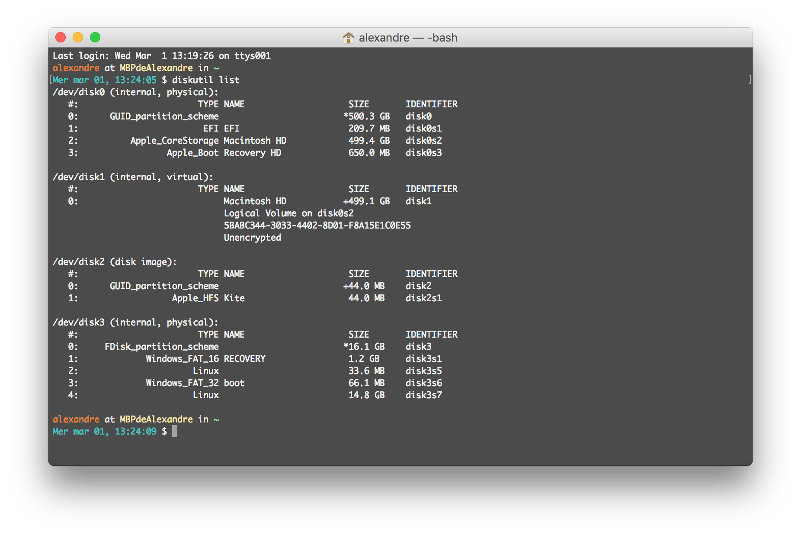

# Clone SD Card on macOS
<center>[Home](../index.html)</center>

[TOC]

1. Insert Your SD Card
Ensure that you have inserted the SD Card, that you wish to clone, into the SD Card reader of your Mac. If your Mac does not have an internal SD Card reader, you will need to plug in an external SD Card reader via a USB socket.

2. Locate Your SD Card
Open Terminal and enter the following command to locate your SD Card:

```bash
diskutil list
```



3. Cloning Your SD Card
Whether your RPi SD Card is all set up as you want it, or you just want to make an incremental clone before installing some software, backing up your SD Card could save you time in the long run.

In my example, my SD Card is /dev/disk3. Amend this as necessary for yours. In Terminal, enter the following command to create a disc image (.dmg) of your SD Card on the Desktop.

```bash
sudo dd if=/dev/disk3 of=~/Desktop/raspberrypi.dmg
```

4. The process to clone the SD Card may take some time and you will not be shown any progress, in Terminal, whilst the SD Card is being copied. You will, however, be shown a message when the process is complete.

The copying process may take some time and will take longer for larger capacity SD Cards. To give you an idea the process to backup an 16GB SD Card took 36 minutes 32.

## Additional source
* [computers.tutsplus.com](https://computers.tutsplus.com/articles/how-to-clone-raspberry-pi-sd-cards-using-the-command-line-in-os-x--mac-59911)


***

<center>ToolKit © 2017</center><center><a href="http://alexandre-ducobu.esy.es/En">About</a> </center>
