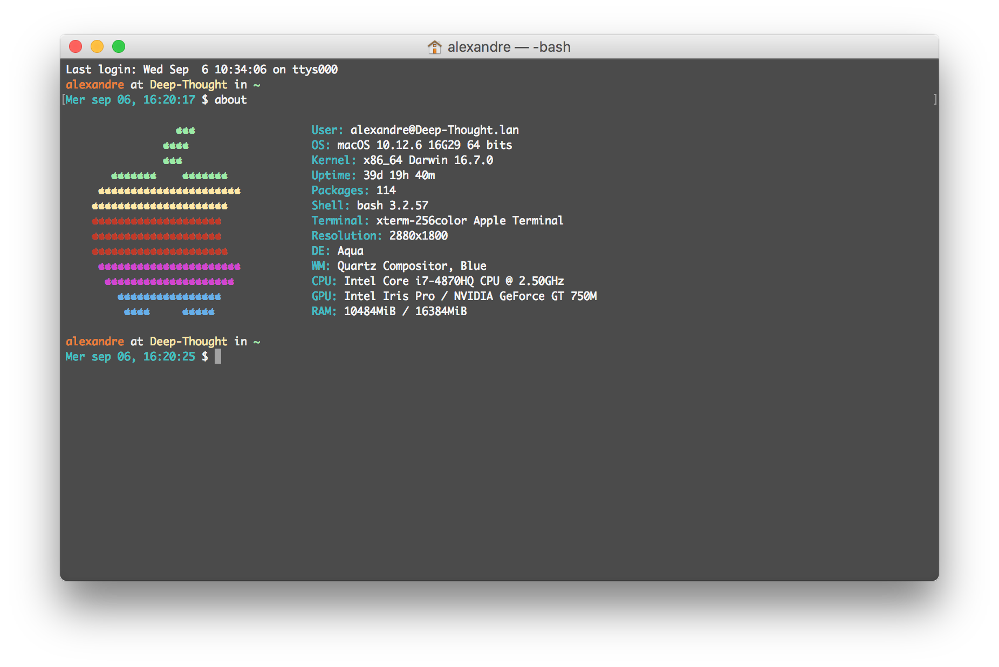

# Configure Terminal (UNIX)
<center>[Home](../index.html)</center>

[TOC]

## Use an updated **_.bash\*_** file

### First method

Close and re-open the Terminal.app (or other).

### Second method (fastest)

Use this command:

- Format

```bash
source ~/.bash_file
```

- Example

```bash
source ~/.bash_profile
```

## Aliases

[Source](https://doc.ubuntu-fr.org/alias)

### Create files

Create **_.bash\_aliases_** in **~**.

### Link _.bash\_aliases_

Open **_.bash\_profile_** and add:

```bash
if [ -f ~/.bash_aliases ]; then
    . ~/.bash_aliases
fi
```

### Create an alias

Open **_.bash\_aliases_** and add:

- Format  

```bash
alias my_alias='myCommand'
```

- Example  

```bash
alias agu='sudo apt-get update'
```

#### Create a function to use parameters

- Format:

```bash
myFunction() {
	#This function use Two parameters
	command $1 $2
}
alias myAlias=myFunction
```

- Example:

```bash
javaParam() {
	#use the given param to compile and run Java code
	if [ "$1" = "*" ]; then
		javac *.java
		java Main
	else
		javac $1.java
		java $1
	fi
}

alias java=javaParam
```

### List all the aliases

```bash
alias
```

## Custom aliases

### Scripts

#### about

**This is what the script does:**  


> It's located at ~/.MyScripts/about

```bash
alias about='./.MyScripts/about'
```

> _The script is available on my [GitHub](https://github.com/Harchytekt/about)._

## Personnalize terminal

_The default prompt on macOS is:_  

```bash
PS1="\h:\W \u$ ";
export PS1;
```


### Personnalize prompt
Choose the wanted options and colors, and insert them in **PS1**.

#### Example

```bash
PS1="\[$(tput setaf 2)\]\u\[$(tput sgr0)\] at \[$(tput setaf 3)\]\h\[$(tput sgr0)\] in \[$(tput setaf 166)\]\W\[$(tput sgr0)\]\n\d, \t $ ";
export PS1;
```

or, for cleaner

```bash
PS1="\[$(tput setaf 2)\]\u\[$(tput sgr0)\] at ";
PS1+="\[$(tput setaf 3)\]\h\[$(tput sgr0)\] in ";
PS1+="\[$(tput setaf 166)\]\W\[$(tput sgr0)\]\n";
PS1+="\d, \t $ ";
export PS1;
```

or whether

```bash
white=$(tput setaf 15);
green=$(tput setaf 2);
orange=$(tput setaf 166);
yellow=$(tput setaf 3);
reset=$(tput sgr0);

PS1="\[$green\]\u\[$white\] at ";
PS1+="\[$yellow\]\h\[$white\] in ";
PS1+="\[$orange\]\W\[$reset\]\n";
PS1+="\d, \t $ ";
export PS1;
```

**This is the result:**  


#### Colors

The colors used are from the _Chart of the 256 colors_ available in an Xterm with color support.  
[See the chart](https://upload.wikimedia.org/wikipedia/commons/1/15/Xterm_256color_chart.svg)

#### Options

```bash
	\a     an ASCII bell character (07)
    \d     the date in "Weekday Month Date" format (e.g., "Tue May 26")
    \D{format}
           the format is passed to strftime(3) and the result is inserted into the prompt string; an empty format results in a locale-
           specific time representation.  The braces are required
    \e     an ASCII escape character (033)
    \h     the hostname up to the first '.'
    \H     the hostname
    \j     the number of jobs currently managed by the shell
    \l     the basename of the shell's terminal device name
    \n     newline
    \r     carriage return
    \s     the name of the shell, the basename of $0 (the portion following the final slash)
    \t     the current time in 24-hour HH:MM:SS format
    \T     the current time in 12-hour HH:MM:SS format
    \@     the current time in 12-hour am/pm format
    \A     the current time in 24-hour HH:MM format
    \u     the username of the current user
    \v     the version of bash (e.g., 2.00)
    \V     the release of bash, version + patch level (e.g., 2.00.0)
    \w     the current working directory, with $HOME abbreviated with a tilde (uses the value of the PROMPT_DIRTRIM variable)
    \W     the basename of the current working directory, with $HOME abbreviated with a tilde
    \!     the history number of this command
    \#     the command number of this command
    \$     if the effective UID is 0, a #, otherwise a $
    \nnn   the character corresponding to the octal number nnn
    \\     a backslash
    \[     begin a sequence of non-printing characters, which could be used to embed a terminal control sequence into the prompt
    \]     end a sequence of non-printing characters
```


***

<center>ToolKit © 2017</center><center><a href="http://alexandre-ducobu.esy.es/En">About</a> </center>

