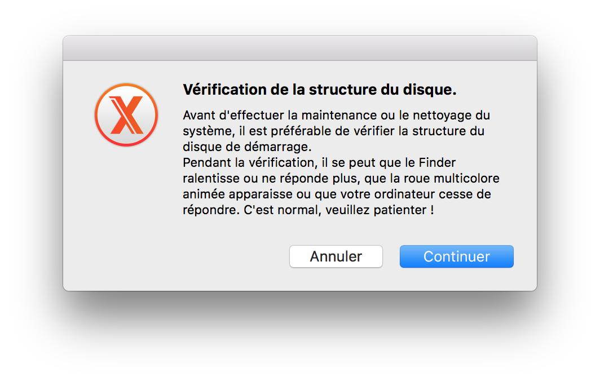

# Maintenance (macOS)
<center>[Home](../index.html)</center>

[TOC]

<a name="RepairPermissions"></a>
## Repair permissions (Home folder)

> If the permissions of the **home** folder changed, you could experience issues (see [Apple support](https://support.apple.com/en-us/HT203538)).  
> Thus, we need to reset permissions to avoid these issues.

These are the differents steps:  

1. From the Finder menu bar, choose Go > Home. Your home folder opens.  

2. Choose File > Get Info. An Info window for your home folder opens.  

3. If the “Sharing & Permissions” section at the bottom of the window isn't open, click the triangle in that section to open it.  

4. If the Lock button at the bottom of the window shows a closed lock 🔒, click the lock and enter an administrator name and password.  

5. Click the Action menu (with a star wheel) in the bottom corner of the window, then choose “Apply to enclosed items.” Click OK to confirm the action. A progress bar appears at the top of the window.  

6. When the progress bar completes, open the Terminal app from the Utilities folder of your Applications folder.  

7. Paste or type this command in Terminal, then press Return:
```bash
diskutil resetUserPermissions / `id -u`
```  

> After entering the diskutil command, if Terminal says that permissions reset on user home directory failed (error -69841), enter ```bash chflags -R nouchg ~```, then enter the diskutil command again.

8. When the process completes, quit Terminal.

## Install [OnyX](http://www.titanium.free.fr)
> OnyX is a multifunction utility for macOS which you can use to verify the startup disk and the structure of its system files, to run miscellaneous tasks of cleaning and system maintenance, to configure some hidden parameters of many of Apple’s applications, and more.

### OnyX's startup
At OnyX's startup, it suggest to verify the structure of the Mac's startup disk:  



> You have the possibility to deactivate this verification, through **Preferences** > **Advanced**.

There are two results:  

#### The disk is correct
There is nothing to do.

#### The disk needs to be repared  

1. You have to restart the computer and after the chime hold down the **Command** and **R** keys (⌘ + R) until the Utility Menu appears.

2.  Select Disk Utility and press the Continue button.  

3. Then select the indented (usually, Macintosh HD) volume entry from the the side list.

4. Click on the First Aid (_SOS_ in french) tab in the toolbar and wait for the Done button to activate. Click on it, then quit Disk Utility.  

5. Select Restart from the Apple menu.

### Maintenance

> The Maintenance area provides access to common system maintenance tasks, such as verifying the Mac's startup disk, running maintenance scripts, rebuilding services and cache files, and repairing file permissions.  

#### Repair file permissions

> This feature has no longer much interest since Apple introduced new protections on system folders.  
> Hence it doesn't works on the home folder of the user anymore.  
> It's thereby recommended to follow [the previously given steps](#RepairPermissions).

Permissions repair used to be a standard troubleshooting tool with _(Mac)_ OS X, but ever since OS X El Capitan, Apple removed the permissions repair service from Disk Utility as being a service no longer needed, since the company started protecting system file permissions in El Capitan.

### Cleaning

> The Cleaning section allows you to delete system cache files, which can sometimes become corrupt or unusually large. Either issue can cause problems with your Mac's performance. Removing cache files can sometimes correct problems, such as an SPOD (Spinning Pinwheel of Death) and other minor annoyances.  

> Cleaning also provides a way to remove large log files, and erase trash or specific files securely

This section suggests many cleaning operations such as cleaning:  

- the Internet and _User and System_ caches;  
- the cookies;  
- the favicons;  
- the histories;  
- the _diagnostic reports_;  
- the old iTunes libraries;  
- …  

> Nota Bene : Don't clean the system caches if you use **_Trim Enabler_**.   
> The _Trash_ tab allows you to execute a _Secure Empty Trash_ action **(_not recommended with SSD or Fusion Drive_)**.

### Automation

> This is a handy feature that lets you automate routine tasks you may use Onyx for.  
> For example, if you always verify the startup drive, repair permissions, and rebuild the LaunchServices database, you can use Automation to perform those tasks for you instead of performing them one at a time.

> Unfortunately, you can’t create multiple automation tasks; just a single one containing all the tasks you wish to have executed together.

Examples of options:  

- LaunchServices: fixes possible errors such multiple iterations of an unique app in the **Open With** menu, wrong opening app with a double click on a file, wrong icons of files and folders,…

- Mail's mailboxes: rebuilds the mailboxes index to prevent et fix possible mail display problems such incomplete, truncated or missing mails.  
- …

### Utilities

> Onyx also provides access to many of the hidden apps that are already present on your Mac, just stashed away within the recesses of the system folder.  

> You can access the Terminal's man pages without having to open the Terminal app, change file and disk visibility, and generate checksums for files.  

#### Manuals

It contains hundreds of UNIX commands. These, accessible from the Terminal app, are widely documented in the **_man pages_**.  
In this section, you can format and display the man pages and even turn them into PDF (_reserved for insiders_).

#### Finding

You can make fast search of file or folder through the database index (**_locate_**) which stores the name of every items of the hard drive.  
This feature can be useful but you'll have to create the database before using it by clicking the **Create** button.  
It's also possible to rebuild or delete it.

#### Process

It allows to activate a command storing the accounting of the processes of all the accounts in a file.  
**Pay attention:**  This file may use a lot of space on the disk (_reserved for insiders_).

#### Visibility

Allows you to change the visibility status of a volume, folder or file.  
**Pay attention:** This isn't allowed on certain items if the System Integrity Protection (**_SIP_**) is activated (_recommended_).

#### AppleDouble

Allows you to remove the _AppleDouble_ files (_reserved for insiders_).  
These files, beginning by **.\_**, are created by the System when an application adds datas or metadatas to a file on a disk whose the format doesn't support them (such as _MS-DOS USB sticks_).

#### Packages

This section displays the content of packages (_reserved for insiders_).  
During the installation of packages (**.pkg**), a receipt (**.bom**), containing a list of all the installed items, is created and stored in a System folder.  
This command (_lsdom_) allows you to display the content of these files.

#### Sum check

In this section, you have the hability to calculate the checksum of files.  
**Pay attention:** This calculation may be long with big files.  

There are several available format as: MD5, SHA, SHA-1, SHA-256,…

#### Applications

Allows you to launch some default applications which are difficult to access.  
This is a list of them: Storage management, Screen Sharing, Wireless or Network Diagnostics, …

### Parameters

> The Parameters tab gives you access to many of the hidden features of the system as well as individual apps.  

> Some of the features you can control are already present in the system preferences, such as showing graphics effects when opening a window.  
> Others are parameters you usually need Terminal to set, such as the graphics format used to capture screen shots.  
> _For those of you who like to hack the Dock, there are some interesting options, including having the Dock only show icons for active apps._  

> Parameters is probably the most fun part of Onyx, as it gives you control over many of the GUI elements of your Mac, letting you alter the look of the Mac, and add a more personalized interface.

### Info and Logs

> We can quickly get them out of the way due to their somewhat basic functions.

#### Info

Info provides information equivalent to the **_About This Mac_** Apple Menu item. It goes a few steps further by giving you easy access to the list of malware that the Mac's built-in XProtect malware detection system is able to protect your Mac from.  
It's handy to know what your Mac is protected from, and when the last update to the protection system was performed.

It also allows you to enable/disable journaling ("Disk" tab) and, to purge the inactive memory and reload the active memory ("Memory" tab).

#### Logs

The Log button brings up a time-based log showing every action performed by Onyx.  
By default, this log is automatically erased when you quit OnyX (you can change this in the **Preferences**).


***

<center>ToolKit © 2017</center><center><a href="http://alexandre-ducobu.esy.es/En">About</a> </center>

