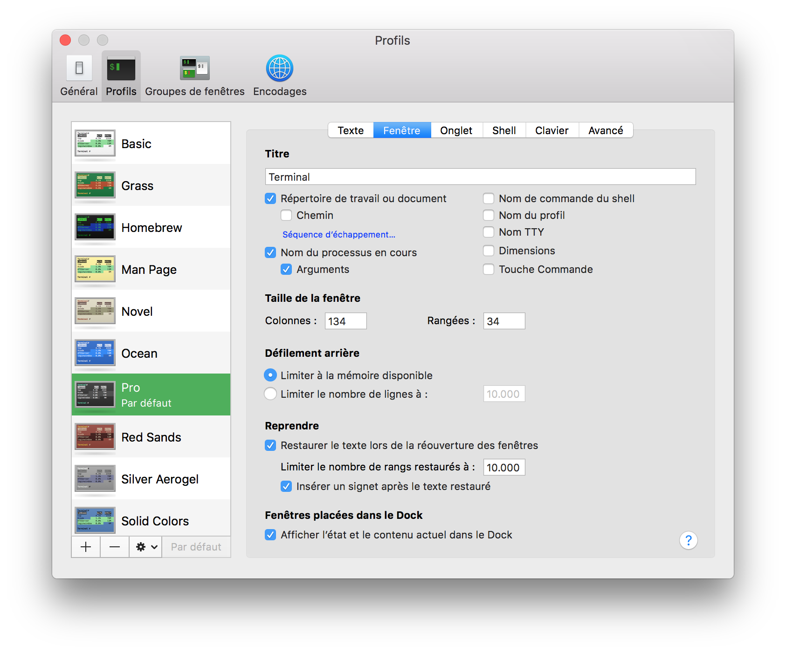

#Script macOS installation
<center>[Home](../index.html)</center>

[TOC]

##Add an user to the sudoers file

> Log in as an Administrator  
> 
> Launch Terminal and type:  

```bash
sudo visudo
```

> Navigate trough the file until:  

```vim
##
# User specification
##

# root and users in group wheel can run anything on any machine as any user
root            ALL = (ALL) ALL
%admin          ALL = (ALL) ALL
```
  
> Enter in **INSERT** mode and add the following line:

```vim
alexandre       ALL = (ALL) ALL
```
  
> Now exit the **INSERT** mode and type this to exit _vim_:

```vim
:wq
```
  
> Hit the : key (colon) and then type “wq” followed by the Return key to save changes and exit vi   

##Personnalize Terminal

###The template

> 1. Launch Terminal, go to Preferences and choose the **Pro** profile at launch (_General tab_).  
> 2. In Profiles, choose **Pro**.  
> 3. Then, go to the sprocket at the bottom and import the **_Pro.terminal_** file.

> Now, you should have this:  



###The prompt
> See [the appropriate page](Configure Terminal.html).  

> You can simply use the [bash files from my GitHub](https://github.com/Harchytekt/myconfig/tree/master/bash_files).  

```bash
cp Desktop/bash_path.sh .bash_path
cp Desktop/bash_aliases.sh .bash_aliases
cp Desktop/bash_prompt.sh .bash_prompt
cp Desktop/bash_profile.sh .bash_profile
```

> **Warning** Some things aren't installed yet.  
> If you choose to use these files at this time, you'll have install the _git tools_.

##Install the software
> Set the **execution** right to the [script from GitHub](https://github.com/Harchytekt/myconfig/tree/master/installation%20script).

```bash
chmod u+x post_install.sh
```

> **REMARQUE:** The user has to be _Administrator_ !  
> Launch the **post_install.sh** srcipt.  

```bash
/Users/alexandre/Desktop/post_install.sh
```

> You can now make it _Standard_ again.

##Restore the apps' settings

> Once Dropbox set, you have to install **[Mackup](https://github.com/lra/mackup)**:  

```bash
brew install mackup
```

> Now, you just have to launch it and back up your files:  

```bash
mackup restore
```

> To copy back any synced config file to its original place, you just have to type:  

```bash
mackup uninstall
```


***

<center>ToolKit © 2017</center><center><a href="http://alexandre-ducobu.esy.es/En">About</a> </center>
